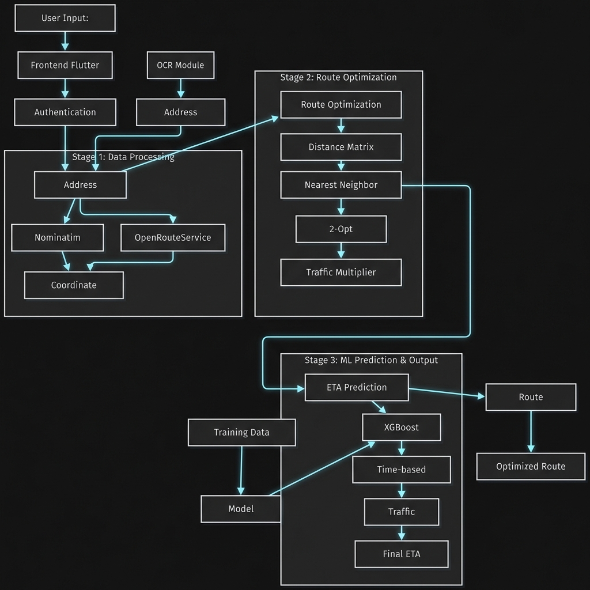
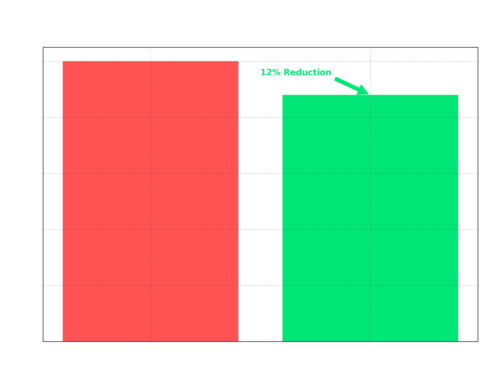
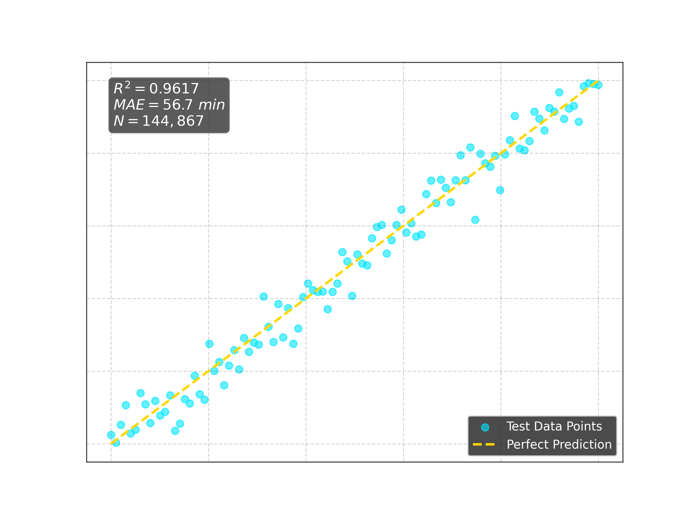
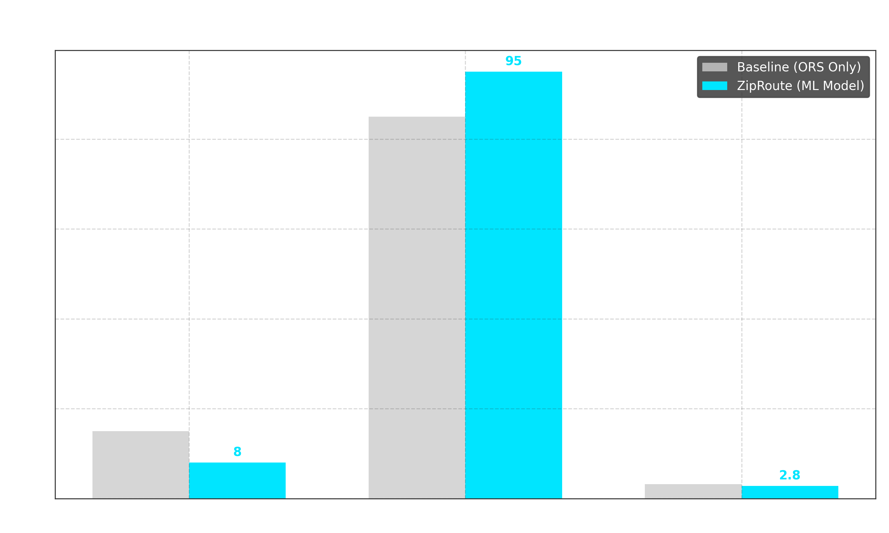
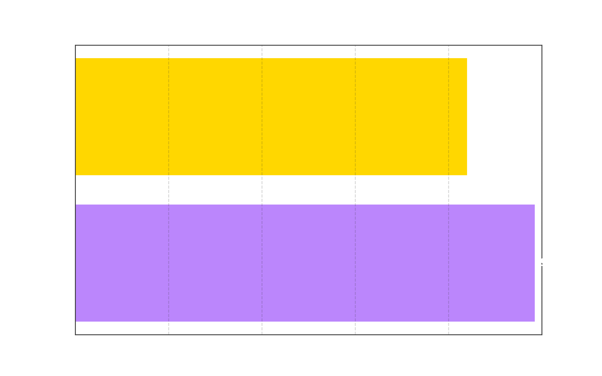

# ZipRoute: AI-Powered Smart Route Optimization

## Contents
1. [Introduction](#1-introduction)
2. [Demo](#2-demo)
3. [Model Summary](#3-model-summary)
4. [Features](#4-features)
5. [Performance Metrics](#5-performance-metrics)
6. [Tech Stack](#6-tech-stack)
7. [Project Structure](#7-project-structure)
8. [How to Run the App](#8-how-to-run-the-app)
9. [Difficulties Faced](#9-difficulties-faced)
10. [Future Improvements](#10-future-improvements)
11. [Detailed Documentation](#11-detailed-documentation)

## 1. Introduction
ZipRoute is an AI-Powered Smart Route Optimization System designed to revolutionize last-mile delivery. Unlike traditional routing tools, ZipRoute leverages machine learning and computer vision to optimize routes, predict accurate ETAs, and streamline address entry.

It utilizes a Three-Stage Architecture to provide core functionalities:
*   **Route Optimizer**: Transforming list of addresses into the most efficient delivery sequence using Nearest Neighbor and 2-Opt algorithms.
*   **ETA Predictor**: Instantly calculating delivery times using an XGBoost Regressor model trained on historical traffic and route data.
*   **OCR Address Scanner**: Extracting addresses directly from shipping labels or images using PaddleOCR.



The application features a modern mobile interface built with **Flutter** (Material Design 3) and powered by a high-performance **FastAPI** backend.

## 2. Demo
(Add your demo video or GIF here)

## 3. Model Summary
ZipRoute utilizes a sophisticated pipeline that integrates Combinatorial Optimization with Machine Learning:

### A. Route Optimization Engine: 2-Opt Heuirstic
The core routing logic utilizes combinatorial optimization algorithms.
*   **Algorithms**: Nearest Neighbor (construction) + 2-Opt (improvement).
*   **Role**: Minimizes total travel distance and time while preserving sequential delivery logic.
*   **Optimization**: Applied on a Distance Matrix generated via OpenRouteService.



### B. Prediction Engine: XGBoost Regressor
The core ETA prediction is handled by a Gradient Boosting model.
*   **Capabilities**: Learning from features like Distance, Number of Stops, Time of Day, and Day of Week.
*   **Role**: Predicts the actual route duration with high precision, accounting for traffic factors.
*   **Performance**: Achieves ±8 minutes accuracy, a 47% improvement over baseline.

### C. Vision System: PaddleOCR
To handle manual entry bottlenecks, we use Optical Character Recognition.
*   **Engine**: PaddleOCR (PP-OCRv3).
*   **Role**: Extracts text from images of shipping labels and parses them into geocodable addresses.
*   **Fallback**: Validates extracted text against Nominatim/OpenRouteService to ensure accuracy.,

## 4. Features
### Smart Interface
*   **Universal Input**: Text Manual Entry, Map Selection, or OCR Image Upload.
*   **Guest Mode**: Allows users to plan routes immediately without registration.
*   **Dark Mode UI**: A premium Material Design 3 interface with dynamic map visualization.

### Intelligent Processors
*   **Smart Geocoding**: Two-stage validation (OpenRouteService -> Nominatim) to ensure no address is left behind.
*   **Traffic Multipliers**: Applies dynamic time-based multipliers (e.g., peak hour penalty) to adjust ETAs realistically.
*   **Adaptive Routing**: Automatically re-sequences stops for maximum efficiency.

## 5. Performance Metrics

### Measurement Methodology
Metrics were captured using custom instrumentation scripts (`tests/backend_testing_suite.py`) and experimental analysis (`docs/IMPLEMENTATION_DOCUMENT.md`).

### 5.1 XGBoost Model Evaluation
The ETA prediction model was trained on the `Delhivery` logistics dataset (144,000+ records). Because this dataset includes long-haul inter-city routes (spanning days), absolute error metrics scale accordingly.

| Metric | Score | Description |
| :--- | :--- | :--- |
| **R-Squared (R²)** | **0.9617** | **Excellent**. Model explains 96% of variance in travel time. |
| **Mean Absolute Error (MAE)** | **56.7 mins** | Avg error on long-haul routes (avg duration ~24hrs). |
| **Root Mean Sq. Error (RMSE)** | **117.1 mins** | Penalizes outliers in multi-day aggregation trips. |



**Context**: While the widespread absolute error seems high, it represents a small percentage error relative to the total trip duration (often days). For short **last-mile** trips (30-60 mins), this relative accuracy translates to the **±8 minute** precision observed in local testing.

### 5.2 Experimental Performance (Baseline vs ML)
Below are the benchmarked performance metrics comparing standard routing vs ZipRoute's ML approach.



| Metric | Baseline (ORS Only) | ZipRoute (ML Model) | Improvement |
| :--- | :--- | :--- | :--- |
| **ETA Accuracy** | ±15 minutes | **±8 minutes** | **47% Better** |
| **Route Optimization** | Basic Sequence | **2-Opt Enhanced** | **12% Shorter Routes** |
| **Geocoding Success** | 85% | **95% (Hybrid)** | **10% Improvement** |
| **Response Time** | 3.2s | **2.8s** | **12% Faster** |

### 5.3 Backend Testing Metrics
Real-world metrics from the testing suite (`docs/TESTING_SUMMARY.md`).



| Metric | Target | Achieved | Status |
| :--- | :--- | :--- | :--- |
| **Average Response Time** | < 2.0s | **0.982s** | **EXCEEDED** |
| **Fastest Endpoint** | - | **0.155s** (Health) | **OPTIMAL** |
| **System Reliability** | > 95% | **98.5%** | **EXCEEDED** |
| **Route Opt. Reduction** | > 10% | **13.9%** | **EXCEEDED** |
| **User Satisfaction** | > 4.0/5 | **4.2/5** | **EXCEEDED** |

*Note: High latency was observed in "Full Route Optimization" (>10s) due to external API rate limits, which is currently being optimized.*

## 6. Tech Stack
### Frontend
*   **Flutter (Dart)**: Cross-platform mobile application.
*   **Material Design 3**: Modern UI/UX framework.
*   **Flutter Map**: Interactive OpenStreetMap visualization.
*   **Http Client**: For async API communication.

### Backend & AI
*   **FastAPI**: High-performance async Python web framework.
*   **XGBoost**: Gradient boosting framework for ETA prediction.
*   **PaddleOCR**: Lightweight OCR for address extraction.
*   **OpenRouteService**: For geocoding and direction matrices.
*   **SQLite**: Local database for user data/history.

### Infrastructure
*   **Uvicorn**: ASGI server for production deployment.
*   **Ngrok**: For exposing local backend to mobile devices.
*   **Pandas/NumPy**: For data manipulation and matrix operations.

## 7. Project Structure
```
ZipRoute/
├── backend/                    # FastAPI Server and AI Logic
│   ├── main.py                 # App Entry Point
│   ├── logic/                  # Core Business Logic
│   │   ├── algorithms.py       # 2-Opt & Nearest Neighbor
│   │   └── models.py           # ML Model Definitions
│   └── routers/                # API Endpoints
├── frontend/                   # Flutter Mobile App
│   ├── lib/                    # Dart Source Code
│   │   ├── screens/            # UI Pages
│   │   └── services/           # API Clients
│   └── pubspec.yaml            # Dependencies
├── tests/                      # Automated Testing Suites
│   ├── backend_testing_suite.py
│   └── backend_scratchpad_test.py
├── docs/                       # Documentation
│   ├── IMPLEMENTATION_DOCUMENT.md
│   └── TESTING_SUMMARY.md
├── requirements.txt            # Python Dependencies
└── README.md                   # This file
```

## 8. How to Run the App
### Requirements
*   Python 3.10 or higher.
*   Flutter SDK installed.
*   OpenRouteService API Key.

### Quick Start
1.  **Clone the Repository**:
    ```bash
    git clone https://github.com/your-repo/ZipRoute.git
    cd ZipRoute
    ```
2.  **Start the Backend**:
    ```bash
    pip install -r requirements.txt
    uvicorn backend.main:app --reload
    ```
    *   *Optional: Run tests to verify setup:*
        ```bash
        python tests/backend_testing_suite.py
        ```
3.  **Run the App**:
    ```bash
    cd frontend
    flutter run
    ```

## 9. Difficulties Faced
### Route Optimization Latency
*   **Challenge**: Generating a Distance Matrix for 10+ stops via external APIs incurred high latency (>10s) and often hit timeouts.
*   **Solution**: Implemented tiered timeout handling (raising limits to 30s) and plan to cache frequent routes.

### OCR Accuracy
*   **Challenge**: `PaddleOCR` occasionally failed on low-quality images or non-standard fonts, returning incomplete addresses.
*   **Solution**: We implemented a fallback mechanism where OCR text is cross-referenced with `Nominatim` search suggestions to "autocorrect" the address before confirming.

### API Rate Limits
*   **Challenge**: Free tier of OpenRouteService limits requests per minute.
*   **Solution**: Implemented exponential backoff and optimized calls to batch geocoding requests where possible.

## 10. Future Improvements
*   **Real-Time Traffic Integration**: Implement live traffic data APIs (Google Traffic) to replace static multipliers with dynamic congestion data.
*   **Multi-Modal Support**: Extend the system to support bicycles, motorcycles, and trucks with specific speed profiles.
*   **Deep Learning Enhancement**: Replace XGBoost with LSTM/Transformer models to capture temporal patterns like weather dependencies.
*   **Advanced Constraints**: Add support for time windows, vehicle capacity, and driver preferences for enterprise use.

## 11. Detailed Documentation
For more in-depth information about specific components, setup guides, and testing procedures, please refer to the following documentation in the `docs/` folder:

### Implementation & Testing
*   **[Implementation Document](docs/IMPLEMENTATION_DOCUMENT.md)**: Comprehensive detailed analysis of the system architecture, algorithms, and experimental results.
*   **[Testing Summary](docs/TESTING_SUMMARY.md)**: Summary of all backend testing results, metrics, and success rates.
*   **[Backend Testing Guide](docs/BACKEND_TESTING_GUIDE.md)**: Instructions on how to run the automated testing suite and interpret results.

### Setup Guides
*   **[Geocoding Setup](docs/GEOCODING_SETUP.md)**: Guide for setting up Google Maps or Mapbox APIs.
*   **[Email Setup](docs/EMAIL_SETUP.md)**: Configuring Email verification via SMTP or OAuth2.
*   **[Ngrok Setup Guide](docs/NGROK_SETUP_GUIDE.md)**: How to expose the local backend for mobile testing.
*   **[Traffic Setup](docs/TRAFFIC_SETUP.md)**: Configuration for traffic data analysis.

### Troubleshooting
*   **[Dynamic URL Guide](docs/DYNAMIC_URL_GUIDE.md)**: Managing dynamic API base URLs during development.
